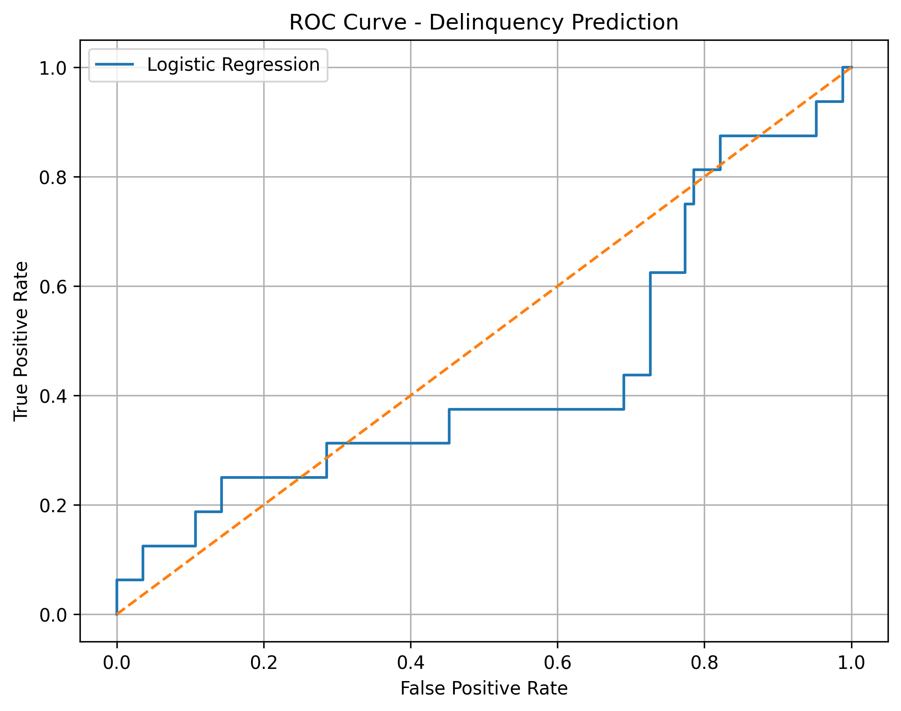
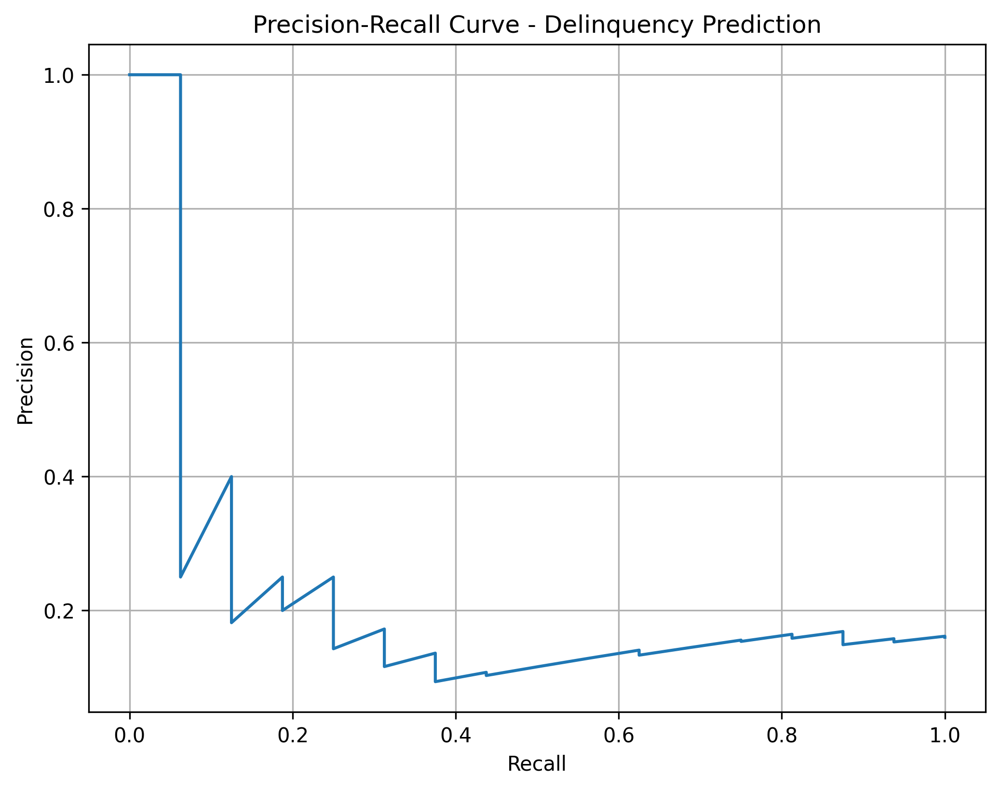

# 📊 Geldium AI: Customer Delinquency Prediction & Collections Strategy

An end-to-end, GenAI-compatible predictive modeling and analytics framework designed to identify delinquent credit accounts. This repository supports Geldium's intelligent, AI-powered collections strategy by predicting customer delinquency risk and optimizing recovery operations.

---

## 📂 Repository Contents

This workspace contains all source code, datasets, and strategic business deliverables for the project:

| File Name | Type | Description |
| :--- | :--- | :--- |
| **[`Delinquency_predictive_model.py`](file:///Users/anitavasava/Desktop/GenAI%20powered%20Data%20Analytics/Delinquency_predictive_model.py)** | `Python Script` | Preprocessing, 5-Fold Stratified CV, Model Comparison, and Champion evaluation. |
| **`Delinquency_prediction_dataset.xlsx`** | `Data (Excel)` | Customer credit attributes, billing cycles, and delinquency status indicators. |
| **[`EDA_SummaryReport.pdf`](file:///Users/anitavasava/Desktop/GenAI%20powered%20Data%20Analytics/EDA_SummaryReport.pdf)** | `Business Report (PDF)` | Comprehensive Exploratory Data Analysis report with data profiling. |
| **[`Geldium_AI_Collections_Strategy.pptx`](file:///Users/anitavasava/Desktop/GenAI%20powered%20Data%20Analytics/Geldium_AI_Collections_Strategy.pptx)** | `Presentation (PPTX)` | Strategic slide deck detailing AI integration and collection roadmaps. |
| **[`Geldium_AI_Collections_Strategy.pdf`](file:///Users/anitavasava/Desktop/GenAI%20powered%20Data%20Analytics/Geldium_AI_Collections_Strategy.pdf)** | `Presentation (PDF)` | PDF version of the strategic slide deck for direct viewing on GitHub. |
| **[`Geldium_Business_Summary_Report.pdf`](file:///Users/anitavasava/Desktop/GenAI%20powered%20Data%20Analytics/Geldium_Business_Summary_Report.pdf)** | `Business Report (PDF)` | Executive summary highlighting deployment plans and business outcomes. |
| **[`Task 2_ModelPlan.pdf`](file:///Users/anitavasava/Desktop/GenAI%20powered%20Data%20Analytics/Task 2_ModelPlan.pdf)** | `Documentation (PDF)` | Plan detailing replication, monitoring, and compliance frameworks. |

---

## 🛠️ Installation & Quick Start

Follow these steps to set up the environment and run the predictive models locally.

### Prerequisites
* Python 3.9 or higher
* macOS: Homebrew is recommended to satisfy the `XGBoost` multithreading dependency (`libomp`):
  ```bash
  brew install libomp
  ```

### 1. Set Up Virtual Environment
Initialize a clean Python virtual environment to manage dependencies:
```bash
python3 -m venv venv
source venv/bin/activate
```

### 2. Install Dependencies
Install all required machine learning and data processing packages:
```bash
pip install --upgrade pip
pip install -r requirements.txt
```

### 3. Run the Model
Execute the main modeling pipeline. This script loads the data, compares Logistic Regression, Random Forest, and XGBoost, selects the champion model, evaluates it on the test set, and saves the evaluation plots:
```bash
python3 Delinquency_predictive_model.py
```

---

## 📈 Model Comparison & Evaluation

Because of the high imbalance in the target variable (16.0% delinquent accounts), models are ranked and selected based on **PR-AUC** (Precision-Recall Area Under the Curve) rather than basic accuracy or ROC-AUC.

### 5-Fold Stratified Cross-Validation Results

| Model | ROC-AUC | PR-AUC | Precision | Recall | F1-Score |
| :--- | :---: | :---: | :---: | :---: | :---: |
| **🏆 Logistic Regression (Champion)** | **0.4801** | **0.1526** | **0.1456** | **0.3594** | **0.2072** |
| **XGBoost** | 0.4715 | 0.1454 | 0.0000 | 0.0000 | 0.0000 |
| **Random Forest** | 0.4654 | 0.1451 | 0.0000 | 0.0000 | 0.0000 |

### Final Test Performance (Logistic Regression Champion)
* **ROC-AUC**: `0.4382`
* **PR-AUC**: `0.2284`
* **Precision**: `0.1220`
* **Recall**: `0.3125`
* **F1-Score**: `0.1754`

> [!NOTE]
> *Logistic Regression with balanced class weighting was selected as the Champion Model due to its ability to identify minor-class instances under severe imbalance where tree-based algorithms (Random Forest and XGBoost) struggled to converge or generate non-zero positive predictions without advanced hyperparameter tuning.*

---

## 🖼️ Generated Visualizations

Running the script automatically produces and saves the following plots to support presentation slides and report generation:

### 1. ROC Curve
The Receiver Operating Characteristic curve illustrates the diagnostic ability of the Logistic Regression model across classification thresholds:


### 2. Precision-Recall Curve
The Precision-Recall curve is particularly suitable for assessing performance on imbalanced datasets, showing the trade-off between precision and recall at different thresholds:

